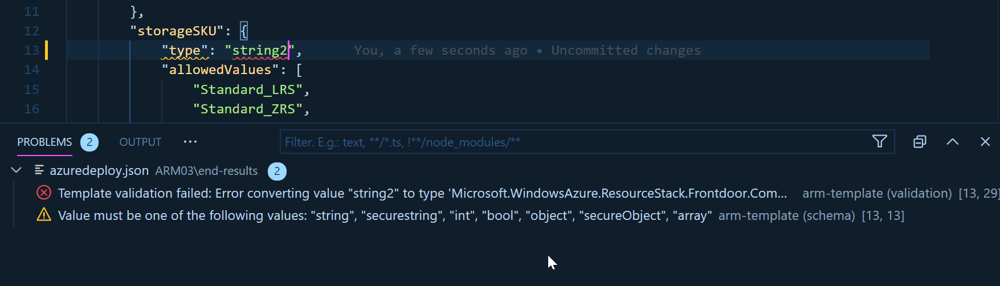

# ARM03 - Parameters

In the previous tutorials we learn how to create resources using an Azure Resources Manager (ARM) template. However, it's was all static and defined *inside* the template.  In this tutorial you will learn how to use parameters to make your template dynamic and easier to use.

Parameter Types
---------------

To make our template dynamic we can pass some information when we call it using parameters. Remember the section parameters in the top of the templates?

```json
{
    "$schema": "https://schema.management.azure.com/schemas/2019-04-01/deploymentTemplate.json#",
    "contentVersion": "1.0.0.0",
    "parameters": {},
}
```
This is where we will define our parameters. There is multiple type of parameters but before we go list them and see some scenarios, let's understand how parameters are defined.

## Parameters Definition in Azure Resource Manager templates 

It's easy to thinks about parameters like a key pair value. Something like a parameters as a name and a value. But there is much more then that. Let's examine here our parameter section.

```json
"parameters": {
  "storageSKU": {
    "type": "string",
    "allowedValues": [
      "Standard_LRS",
      "Standard_ZRS",
      "Standard_GRS",
      "Standard_RAGRS",
      "Premium_LRS"
    ],
    "defaultValue": "Premium_LRS",
    "metadata": {
      "description": "The type of replication to use for the storage account."
    }
  }
}
```

There is one parameter define here named `storageSKU`. It's a string, but because we didn't when the users to write any values we used the `allowedValues` property to list the allowed value for our parameter. AllowedValues is an array of values of any types.

It's a good practice to used two other properties to help the user understand how to use our parameter: `defaultValue` and `description`.  The default value it's a way to say  to the user if you don't know just say nothing. It's an excellent way to make our template easy to use without compromising the flexibility.  Description, part of the metadata section, Is where of  course you give the most detail information about the  expected value and/ or the impact on the deployed resources.

To complement those there is also MinValue, MinLenght, MaxValue, and MaxLenght that will limits what's acceptable as value.

## Parameter Types

There is multiple type of parameter to accommodate the different type of information. We already mention the `string` type and other more also type like `int`, `bool`, and `array`.

Then there is `securestring` a very convenient way to pass a password for example. Using the securestring type will make sure the the information cannot be read after resource deployment.

Finally we have `object` and `secureObject`. With those you can define a complete object with many properties it's extremely powerful. And things become very flexible when you start mixing all those type together, like passing an array of objects! We will cover those scenarios in a next chapter.

## Using Parameters

Now that we know how to declare the parameters, it's time to see how we use them. This can easily be done by using a function name `parameters({parameterName})` that is included in ARM. This function will return the value of the "parameterName". For example `parameters('storageSKU')` will return "Premium_LRS". 

To use this function inside an ARM template we need to place it between square brackets `[]`. In the next sample we set the value of the property equal to the parameter.

```json\
{
   ...
    "name": "[parameters('storageSKU')]",
   ...
}
```

## Deploying with parameters

We learn in the previous chapter different ways how we can deploy an ARM template, but how can you do the same passing the parameter values? Of course with Azure CLI you could just pass all the key-pair value to the command like this:

```
  az group deployment create -g MyResourceGroup --template-file azuredeploy.json --parameters storageName=tstStorage storageKind=StorageV2
```

That's a valid command and it will works. However it's not very convenient and portable. I better way will be to pass a parameter file. And you could have a different file depending of the environment that you are targeting.

```
  az group deployment create -g MyResourceGroup --template-file azuredeploy.json --parameters azuredeploy.parameters.json
```

## Create a Parameter file.

A parameter files is just yet another JSON file. SO you can easily create that in any text editor. However, there is a few really nice feature in the VS Code Extension: [Azure Resource Manager (ARM) Tools](https://marketplace.visualstudio.com/items?WT.mc_id=learningarm-github-frbouche&itemName=msazurermtools.azurerm-vscode-tools) that will make you save a lot of time.

To create a new parameter file simply right-click anywhere in your ARM template, to make the contextual menu to popup. Select **Select/Create Parameter File...**, then **New** and Finally **All parameters**.

This will create a new file with the following structure.

```json
{
    "$schema": "https://schema.management.azure.com/schemas/2015-01-01/deploymentParameters.json#",
    "contentVersion": "1.0.0.0",
    "parameters": {
        "storageSKU": {
            "value": "Premium_LRS"
        }
    }
}
```

A interesting feature of using the *Azure Resource Manager (ARM) Tools* is that it will validate the template and the values of the parameters associated with it.



The validation error message can be see by mouse over or in the **Problem** tab in the console (Ctrl+`).


## More Security

The `securestring` inside the ARM template is really great. Using them will make sure our sensitive information won;t show up in the logs. But if we are using a parameters file then the value will also be present in clear text! To avoid doing this (and by mistake pushing our password in the source control, we need to use [Azure KeyVault](https://docs.microsoft.com/en-us/azure/key-vault/secrets/about-secrets?WT.mc_id=learnARM-github-frbouche). You will need to to have a active KeyVault and you will be able to reference your secret in the parameter file like this: 

```json
{
    "$schema": "https://schema.management.azure.com/schemas/2015-01-01/deploymentParameters.json#",
    "contentVersion": "1.0.0.0",
    "parameters": {
      "adminPassword": {
        "reference": {
          "keyVault": {
          "id": "/subscriptions/<subscription-id>/resourceGroups/<rg-name>/providers/Microsoft.KeyVault/vaults/<vault-name>"
          },
          "secretName": "ExamplePassword"
        }
      },
    }
}
```
In this sample we would pass the secret **secretName** contained in the KeyVault **<vault-name>**. TO know how to create your KeyVault refer to [Use Azure Key Vault to pass secure parameter value during deployment](https://docs.microsoft.com/en-us/azure/azure-resource-manager/templates/key-vault-parameter?tabs=azure-cli&WT.mc_id=learnARM-github-frbouche)


---

## Exercises

Now let's practice the things we learn in the little chapter. You can continue where you left at the previous chapter (ARM02 - Create first template) or start fresh with the files contained in the folder [begin-with]([begin-with/azuredeploy.json)

### 🥖 Add the parameter storageSKU

Add the parameter **storageSKU** define at the top of this file, in the parameter section of the ARM template.


### 🥖 Add the parameter storageName

Add a new parameter **storageName** of type `string`. It should have a description and a maximum length of ten characters.


### 🥖 Use Parameters

All the parameter are defined, replace the hard-coded value of **storage SKU** and **storage Name** by their respective parameter.

### 🥖 Create a Parameter File

Create a parameter file. You can do it manually or using the VSCode extension. Name your file: `azuredeploy.parameters.json`.

### 🥖 Deploy The ARM Template

After confirming that your template and parameter file are valid, deploy it.

```
      az group deployment create -g MyResourceGroup --template-file azuredeploy.json --parameters azuredeploy.parameters.json
```

---

To see if you have done successfully the exercises, compare your files with the once in the folder [end-with]([end-with/azuredeploy.json)


#### Reference: 

- [Parameters in Azure Resource Manager templates](https://docs.microsoft.com/en-us/azure/azure-resource-manager/templates/template-parameters?WT.mc_id=learnARM-github-frbouche)

---

[<-- Episode/ Module 2](../ARM02/README.md) | [Episode/ Module 4 -->](../ARM04/README.md)
