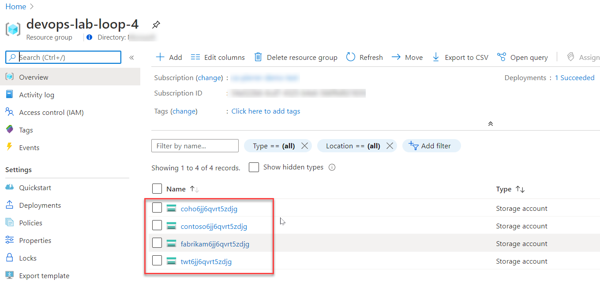

# 9 - Demystifying ARM Templates: Loops

There is only one way to loop in an Azure Resource Manager (ARM) template.  By adding the copy element to the resources section of your template, you can set the number of resources to deploy. You also avoid having to repeat template syntax.

This is very useful to create multiple instance of a specific resource.

The copy element has the following general format:

```json
"copy": {
  "name": "<name-of-loop>",
  "count": <number-of-iterations>,
  "mode": "serial" <or> "parallel",
  "batchSize": <number-to-deploy-serially>
}
```

1. The **name** property is any value that identifies the loop (can't exceed 800).
1. The **count** property specifies the number of iterations you want for the resource type.
1. The **mode** and **batchSize** properties to specify if the resources are deployed in parallel or in sequence.

## Simple loop

The simplest copy as shown in the example below, iterates through the number specified in the `StorageAccountCount` parameter.  It is very important that you pay attention to the name you give your resources.  The name of each resource will need to includes the `copyIndex()` function, which returns the current iteration in the loop. copyIndex() is zero-based. So, the following example:

```json
"name": "[concat('storage', copyIndex())]",
```

Creates these names:

- `storage0`
- `storage1`
- `storage2`

```json
{
    "$schema": "https://schema.management.azure.com/schemas/2019-04-01/deploymentTemplate.json#",
    "contentVersion": "1.0.0.0",
    "parameters": {
        "storageAccountName": {
            "type": "string",
            "defaultValue": "devopslab"
        },
        "storageAccountType": {
            "type": "string",
            "defaultValue": "Standard_LRS"
        },
        "StorageAccountCount": {
            "type": "int",
            "defaultValue": 2
        }
    },
    "variables": {
    },
    "resources": [
        {
            "name": "[toLower(concat(parameters('storageAccountName'),copyIndex(),uniqueString(resourceGroup().id)))]",
            "copy": {
                "name": "storagecopy",
                "count": "[parameters('StorageAccountCount')]"
            },
            "type": "Microsoft.Storage/storageAccounts",
            "apiVersion": "2015-06-15",
            "location": "[resourceGroup().location]",
            "properties": {
                "accountType": "[parameters('storageAccountType')]"
            }
        }
    ],
    "outputs": {
    }
}
```

## Simple serial loop

The serial mode as described in the template below follows the exact same rules and concepts as the simple Copy loop except it waits for the first instance to be complete before it starts the second.  By default, Resource Manager creates the resources in parallel.

```json
{
    "$schema": "https://schema.management.azure.com/schemas/2019-04-01/deploymentTemplate.json#",
    "contentVersion": "1.0.0.0",
    "parameters": {
        "storageAccountName": {
            "type": "string",
            "metadata": {
                "description": "Name of storage account"
            },
            "defaultValue": "devopslab"
        },
        "storageAccountType": {
            "type": "string",
            "metadata": {
                "description": "Type of storage account"
            },
            "defaultValue": "Standard_LRS"
        },
        "StorageAccountCount": {
            "type": "int",
            "defaultValue": 5,
            "metadata": {
                "description": "Number of storage accounts"
            }
        }
    },
    "variables": {
        "storageApiVersion": "2015-06-15"
    },
    "resources": [
        {
            "name": "[toLower(concat(parameters('storageAccountName'),copyIndex(),uniqueString(resourceGroup().id)))]",
            "copy": {
                "name": "storagecopy",
                "count": "[parameters('StorageAccountCount')]",
                "mode": "serial"
            },
            "type": "Microsoft.Storage/storageAccounts",
            "apiVersion": "[variables('storageApiVersion')]",
            "location": "[resourceGroup().location]",
            "properties": {
                "accountType": "[parameters('storageAccountType')]"
            }
        }
    ],
    "outputs": {
    }
}
```

## Simple serial batched loop

To serially deploy more than one instance of a resource, set mode to serial. And should you want to control how many instances are deployed at a time use the `batchSize` parameter.

```json
{
    "$schema": "https://schema.management.azure.com/schemas/2019-04-01/deploymentTemplate.json#",
    "contentVersion": "1.0.0.0",
    "parameters": {
        "storageAccountName": {
            "type": "string",
            "defaultValue": "devopslab"
        },
        "storageAccountType": {
            "type": "string",
            "defaultValue": "Standard_LRS"
        },
        "StorageAccountCount": {
            "type": "int",
            "defaultValue": 6
        }
    },
    "variables": {
        "storageApiVersion": "2015-06-15"
    },
    "resources": [
        {
            "name": "[toLower(concat(parameters('storageAccountName'),copyIndex(),uniqueString(resourceGroup().id)))]",
            "copy": {
                "name": "storagecopy",
                "count": "[parameters('StorageAccountCount')]",
                "mode": "serial",
                "batchSize": 2
            },
            "type": "Microsoft.Storage/storageAccounts",
            "apiVersion": "[variables('storageApiVersion')]",
            "location": "[resourceGroup().location]",
            "properties": {
                "accountType": "[parameters('storageAccountType')]"
            }
        }
    ],
    "outputs": {
    }
}
```

## Array loop

the Array loop, allows you to control more tha just the number of resources. in this example we have an array defined in the parameter section.

in our case the array contains the following names.

- "twt"
- "contoso"
- "fabrikam"
- "coho"

the `count` parameter of the copy section counts the number of items in the array and uses that number to set the loop.

```json
{
    "$schema": "https://schema.management.azure.com/schemas/2019-04-01/deploymentTemplate.json#",
    "contentVersion": "1.0.0.0",
    "parameters": {
        "storageAccountType": {
            "type": "string",
            "metadata": {
                "description": "Type of storage account"
            },
            "defaultValue": "Standard_LRS"
        },
        "StorageAccountNames": {
            "type": "array",
            "defaultValue": [
                "twt",
                "contoso",
                "fabrikam",
                "coho"
            ],
            "metadata": {
                "description": "Array of storage account names"
            }
        }
    },
    "variables": {
    },
    "resources": [
        {
            "name": "[toLower(concat(parameters('StorageAccountNames')[copyIndex()],uniqueString(resourceGroup().id)))]",
            "copy": {
                "name": "storagecopy",
                "count": "[length(parameters('StorageAccountNames'))]"
            },
            "type": "Microsoft.Storage/storageAccounts",
            "apiVersion": "2015-06-15",
            "location": "[resourceGroup().location]",
            "properties": {
                "accountType": "[parameters('storageAccountType')]"
            }
        }
    ],
    "outputs": {
    }
}
```

You must be careful here as well for your naming.

In our example We are using `"name": "[toLower(concat(parameters('StorageAccountNames')[copyIndex()],uniqueString(resourceGroup().id)))]`

so the names of the resources will have the names in the array wih a unique identifier as a suffix.



[<-- Episode/ Module 8](../ARM08/README.md) | [Episode/ Module 10 -->](../ARM10/README.md)