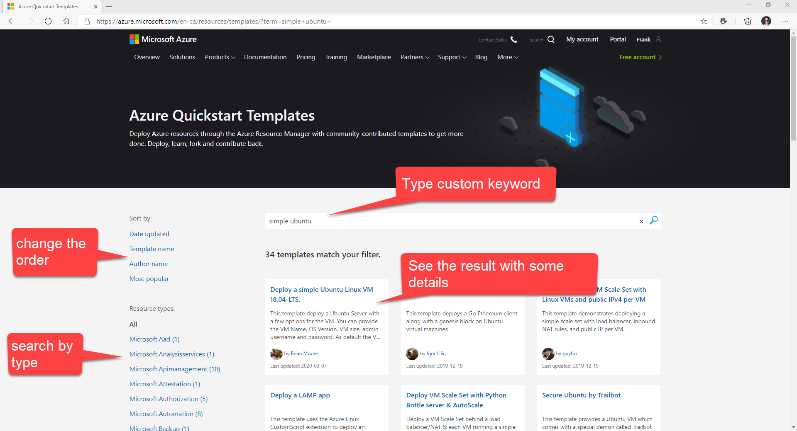
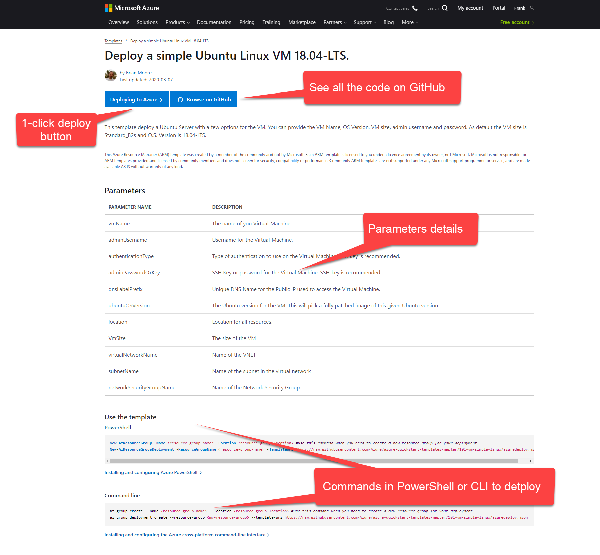
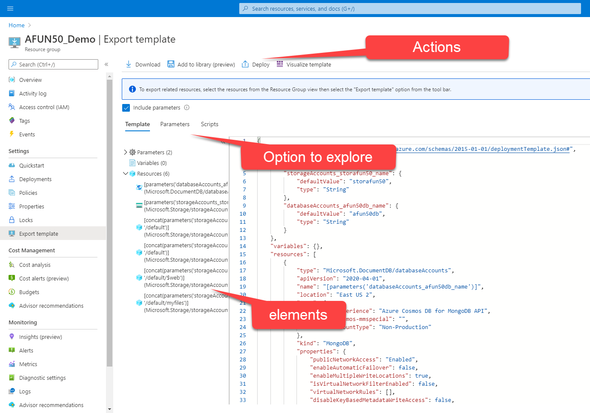
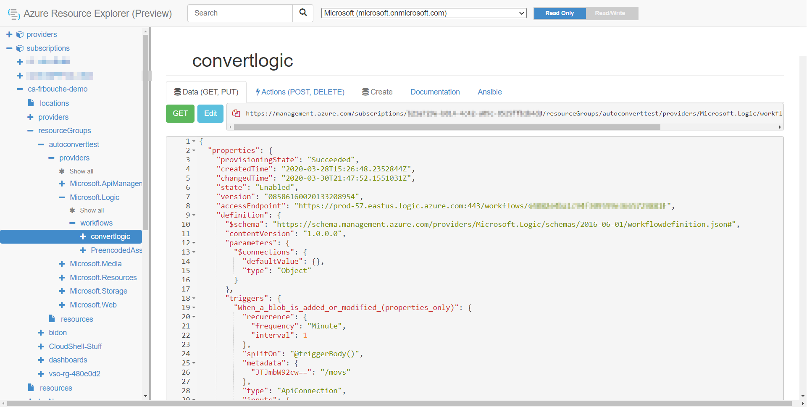

# 10 - Demystifying ARM Templates: Getting an ARM template for Resource X

The ARM template are very powerful and useful, we can agree on that. However, something it could be hard to get started. In this tutorial you will learn tips and tricks to start from scratch with existing template or export the template from existing resources. 

## Azure DevOps - DevOps Lab - Video

- [YouTube](https://youtu.be/YrEAy7oLVew)
- [Channel9](https://channel9.msdn.com/Shows/DevOps-Lab/ARM-Series-10-Template-for-Resource-X?WT.mc_id=learnARM-github-frbouche)

Azure Quickstart Templates
--------------------------

Let's say you would like to create a website with a database or a simple Ubuntu Linux VM 18.04-LTS. Your are definitely NOT the first one to try this... So with the help of the community Microsoft maintains a Azure Quickstart Templates Gallery. It's available from [GitHub](https://github.com/Azure/azure-quickstart-templates), of course, but also with a more friendly search and index directly from the azure website! Go visit [http://aka.ms/quickarm](https://azure.microsoft.com/en-us/resources/templates/?WT.mc_id=learnARM-github-frbouche) And let's do some research...

From the search bar in the middle of the screen type something like: *simple Ubuntu VM*. You will now see multiple result matching those keywords. You can also search by resource type from the left, and change the order of the result displayed.

When you click on one of those result you will open the detail page where you will have a clear, easy to read list of the parameters, the commands in PowerShell and CLI to deploy the template. On the top of the page you will also find a 1-click deploy to Azure button and another one to bring you to GitHub to see the ARM files.

Export the ARM template
-----------------------

These Quickstart Templates are great when we start from scratch, what if you would like to "reverse engineer" a solution that you have already up and running in your subscription?

In those case you have two solutions. The first one is the Azure Portal (portal.azure.com). Open the Resource Group or the resource for which you would like to get an ARM template. Now from the left panel select the option **Export template**.

This will open a new blade where you will be able to explore the ARm template. You can see all the resource included, and also all the generated parameters.

From this page you can decide to download the template, save it to your online library, or even visualize the template.

Azure Resource Explorer
-----------------------

The second option to see the ARM template from existing resources is to use the Azure Resource Explorer. You can easily find it at [https://resources.azure.com/](https://resources.azure.com/)

From there you can select the subscription you want and start exploring the resource you are looking for. 

It's a must have for sure!

## References

- [Azure Quickstart Templates](https://azure.microsoft.com/en-us/resources/templates/?WT.mc_id=learnARM-github-frbouche)
- [GitHub - ARM Quickstarts](https://github.com/Azure/azure-quickstart-templates)
- [Resources Explorer](https://resources.azure.com/?WT.mc_id=learnARM-github-frbouche)

[<-- Episode/ Module 9](../ARM09/README.md) | [Episode/ Module 11 -->](../ARM11/README.md)

