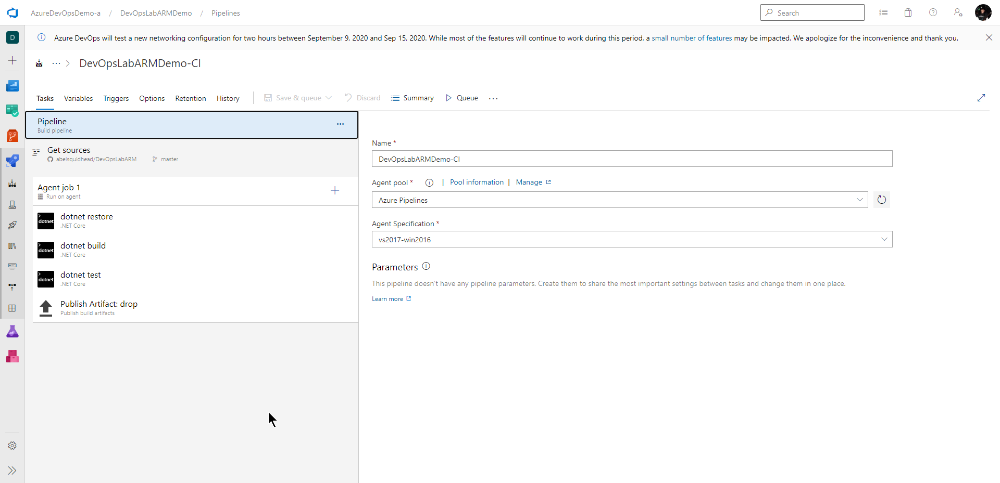
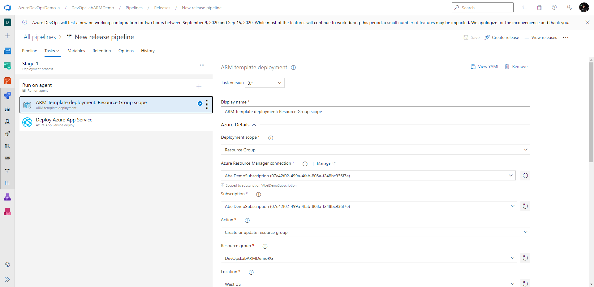
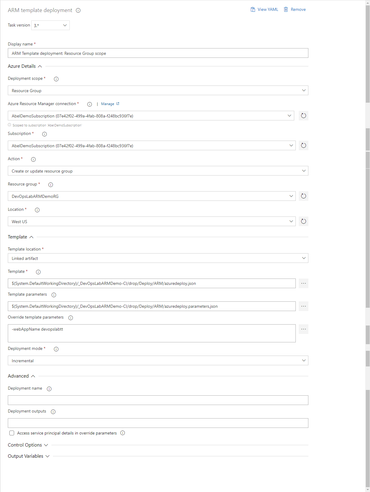

# 12 - Demystifying ARM Templates: Azure DevOps With ARM Templates
If you need Infrastructre as Code for Azure, ARM templates are an extremely powerful and flexible solution. This power and flexibility becomes even more impressive once you add IaC into your CI/CD Pipelines. 

Some key benefits
- having your IaC right alongside your source code means everything gets versioned together
- infrastructure changes can be reviewed with the same pull request process as application code
- being able to go from nothing in Azure, to a fully provisioned and configured environment in Azure, and then deploying your App into that environment is priceless
- protection from configuration drift in subsdquent releases is awesome

## Azure DevOps - DevOps Lab - Video

- [YouTube](https://youtu.be/j4I3C6U8K4c)
- [Channel9](https://channel9.msdn.com/Shows/DevOps-Lab/ARM-Series-12-Azure-DevOps-With-ARM-Templates?WT.mc_id=learnARM-github-abewan)

## Deploy a complete ARM template using Azure DevOps
Azure DevOps Services is a super powerful set of DevOps tooling built directly in Azure. Included in Azure DevOps Services is Azure Pipelines. Azure Pipelines is the CI/CD system.

Normally, I do all my work using YAML to describe my pipelines. However, For this episode of DevOps Lab, I used the classical editor as the UI is really nice for demos. It demos way better than a wall of yaml!

Azure Pipelines is basically a task runner. It runs one task after another after another. Out of the box, Azure Pipelines comes with a full set of tasks that do all sorts of things. There is also a market place where our partners have created thousands of tasks. You can also create your own custom tasks.

## Crafting the pipeline
The plan for this pipeline was to build the application, bundle everything up so it's ready to be deployed (this means the web app and the ARM template), provision/configure my environment up in Azure using my ARM template, and then deploying my application into that environment.

### Build
The build pipeline for the demo was super simple. This was just your standard .NET core build. At the end, I published the entire sources directory as this would grab up my web app all bundled up as a zip file, and my IaC ARM template [azuredeploy.json](./azuredeploy.json).

  

### Release
The release pipeline in this demo is pretty simple too. I first deploy my ARM template using and ARM template deploy task (comes out of the box). And when that's done, I deploy my app to the Azure App Service provisioned by my ARM template.

  

For my ARM template deploy task, here are the properties used:

  

Notice for Action I selected Create or update resource group. This will create my Azure resource group if it doesn't exist. And if it does, it will just modify it.

Also, noticed I picked Incremental as my Deployment Mode. For this demo, I didn't have to pick Incremental. Complete would have worked too. However it's important to know the difference. Incremental means any resources that exist in the resource group NOT definied in the ARM template is left as is. In Complete mode, any resources not defined in an ARM template will be deleted.

## Conclusion
Deploying ARM templates inside of Azure DevOps is super easy. Pre-built, out of the box tasks make deploying arm templates as easy as dragging, dropping and then filling out some properties.

## References
- [Azure DevOps for build and release](https://docs.microsoft.com/azure/devops/pipelines/get-started/?view=azure-devops&WT.mc_id=learnARM-github-abewan)
- [ARM template deployment modes](https://docs.microsoft.com/azure/azure-resource-manager/templates/deployment-modes?WT.mc_id=learnARM-github-abewan)
- [Deploy to Azure App Service task](https://docs.microsoft.com/azure/devops/pipelines/tasks/deploy/azure-resource-group-deployment?view=azure-devops&WT.mc_id=learnARM-github-abewan)
- [CI/CD with Azure Pipelines and ARM Templates](https://docs.microsoft.com/azure/azure-resource-manager/templates/add-template-to-azure-pipelines?WT.mc_id=learnARM-github-abewan)

[<-- Episode/ Module 11](../ARM11/README.md)
